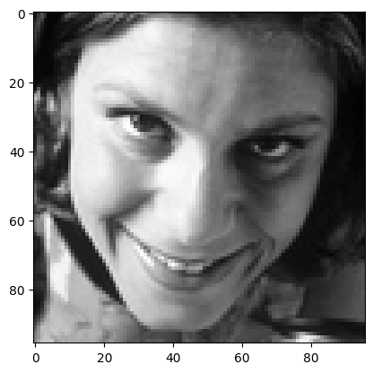
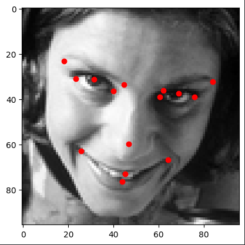
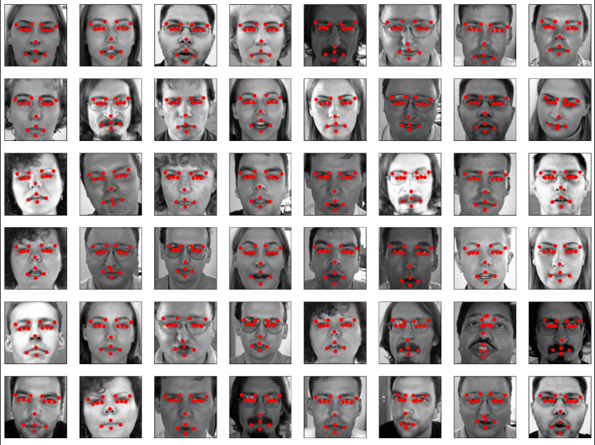

# Facial Keypoints Detection Using CNN
This repository contains a deep learning model that predicts facial landmarks using Convolutional Neural Networks (CNN). Facial landmarks are key points on a person's face, such as the corners of the eyes, nose, and mouth. This project uses a CNN architecture to detect and predict these landmarks, which can be useful in various applications, including facial recognition, emotion analysis, and augmented reality.

## Model Architecture
```python
Sequential([
    Conv2D(16, 3, activation='relu', input_shape=(96, 96, 1)),
    MaxPooling2D(2),
    
    Conv2D(32, 3, activation='relu'),
    MaxPooling2D(2),
    
    Conv2D(64, 3, activation='relu'),
    MaxPooling2D(2),
    
    Conv2D(128, 3, activation='relu'),
    MaxPooling2D(2),
    
    Flatten(),
    Dense(512, activation='relu'),
    Dropout(0.2),
    
    Dense(512, activation='relu'),
    Dropout(0.2),
    
    Dense(30, activation='tanh')
])
```
## Training Results
- **Final Training Loss (MSE):** 9.37e-04  
- **Final Training MAE:** 0.0230  
- **Validation Loss (MSE):** 0.0393  
- **Validation MAE:** 0.0728  
- **Epochs:** 150  
- **Batch Size:** 64  
- **Validation Split:** 20%  

## Key Features
- Input: 96x96 grayscale images  
- Data augmentation with horizontal flipping  
- Custom data loader with normalization  
- Mean Squared Error (MSE) loss with Adam optimizer  
- Model checkpointing for best validation performance  

## Requirements
- Python 3.x  
- TensorFlow/Keras  
- NumPy  
- Pandas  
- Matplotlib (for visualization)

## Sample Input 
<p float="left">
  
  
</p>

## Sample Output

